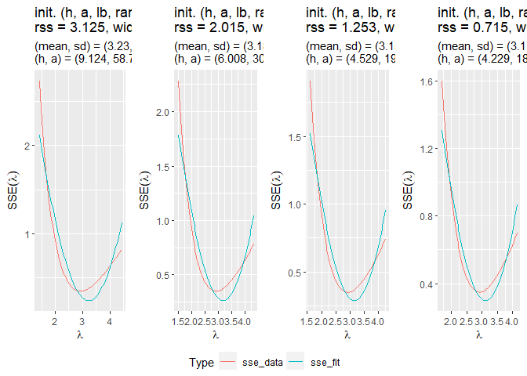

# Estimate Variances of Model Parameters Using Perturbed SSE Curve
Fitting (PSCF) Method
Chien-Lan Hsueh
2023-04-30

- [Packages and Helper Functions](#packages-and-helper-functions)
- [Estimate Variances of Model Parameters Using Perturbed SSE Curve
  Fitting (PSCF)
  Method](#estimate-variances-of-model-parameters-using-perturbed-sse-curve-fitting-pscf-method)
- [Introduction](#introduction)
  - [Background](#background)
  - [Perturbed SSE Curve Fitting (PSCF)
    Method](#perturbed-sse-curve-fitting-pscf-method)
  - [Research Questions](#research-questions)
- [Methods and Data](#methods-and-data)
  - [Methods](#methods)
  - [Data](#data)
- [Study Case: Attenuation Decay](#study-case-attenuation-decay)
  - [Physical Model](#physical-model)
  - [Data Simulation and
    Visualization](#data-simulation-and-visualization)
- [Best Fit Model using Nonlinear Regression
  Model](#best-fit-model-using-nonlinear-regression-model)
- [Perturbed SSE Curve Fitting (PSCF)
  Method](#perturbed-sse-curve-fitting-pscf-method-1)
  - [Curve Flipping and Range
    Selection](#curve-flipping-and-range-selection)
  - [Fitting Strategy I: Fit Without Specifying Initial Fitting
    Range](#fitting-strategy-i-fit-without-specifying-initial-fitting-range)
  - [Fitting Strategy II: Fit With Specifying Initial Fitting
    Range](#fitting-strategy-ii-fit-with-specifying-initial-fitting-range)
  - [Fitting Strategy III: Grid
    Search](#fitting-strategy-iii-grid-search)
- [Bootstrapping CI](#bootstrapping-ci)
  - [Parametric Bootstrap CI](#parametric-bootstrap-ci)
  - [Non-Parametric Bootstrap CI](#non-parametric-bootstrap-ci)
  - [Bootstrap CI Results](#bootstrap-ci-results)
- [Delta Method Normality](#delta-method-normality)
  - [Univariate Delta Method](#univariate-delta-method)
  - [Bivariate Delta Method](#bivariate-delta-method)
  - [Delta Method Results](#delta-method-results)
- [Conclusion](#conclusion)
- [References](#references)



## Packages and Helper Functions

<details>
<summary>Code</summary>

``` r
# packages
if (!require("pacman")) utils::install.packages("pacman", dependencies = TRUE)

pacman::p_load(
  conflicted, here, 
  scales, skimr, glue, gt, GGally, ggpubr, 
  broom, nlshelper, invgamma,
  tidyverse, zeallot
)

# resolve conflicts by setting preference
conflict_prefer("select", "dplyr", quiet = T)
conflict_prefer("filter", "dplyr", quiet = T)

# infix operator: string concatenation (ex: "act" %&% "5")
'%&%' <- function(x, y) paste0(x, y)

# infix operator: not %in%
'%notin%' <- Negate('%in%')
```

</details>



<div class="center">

## Estimate Variances of Model Parameters Using Perturbed SSE Curve Fitting (PSCF) Method

Client: Prof. Robert Hayes (Department of Nuclear Engineering, NCSU)

Team: Chien-Lan Hsueh (Department of Statistics, NCSU)

</div>

## Introduction

A new algorithm has been developed by Prof. Hayes in order to estimate
variances of a model parameter based on perturbation of the best fitted
parameter. This algorithm has been claimed to give a good assessment of
the standard error of the model parameter. The obtained results have
been published in several research articles.

This work is to reproduce the algorithm and compare it with the other
common statistics methods including nonlinear regression models,
bootstrap confidence intervals and the delta normality method.

### Background

Prof. Hayes’ is an active faculty in the department of nuclear
engineering at NCSU. His research of retrospective dosimetry (O’Mara and
Hayes 2018) involves developing a new method to measure radiation
dosages and analyze them to infer the actual radiation exposures.
Although the traditional technique, which is a direct radiation
measurement on the subjects, can provide an accurate depth profile
measurement, it is costly and time consuming. Using the new method he
developed (Hayes and O’Mara 2019), he can use forensic luminescence data
that is high correlated to the actual radiation dosage and an industry
standard Monte Carlo n-particle method (MCNP) (Brown et al. 2004) to fit
the dose deposition profile and estimate the physical model parameter.
Furthermore, with the obtained best fitted model parameter as a
reference, a series of “perturbed” model fittings is then used in a
normal curve fitting to estimate the variance of the parameter. A
detailed description of this algorithm can be found in Dr. O’Mara’s
Ph.D. dissertation (O’Mara 2020).

### Perturbed SSE Curve Fitting (PSCF) Method

For convenience, we call this algorithm Perturbed SSE Curve Fitting
(PSCF) method in this work.

1.  The parameter is estimated by minimizing the sum square of errors
    (SSE) of the model prediction and measurement data.
2.  By deviating from the best fitted value, the sum square of errors is
    expressed as a function of the parameter and has a convex
    “hyperbolic” curve.
3.  After this curve is “flipped” upside down, a Gaussian curve fitting
    is performed to obtain the spread as the estimated variance of the
    model parameter.

### Research Questions

The goal of this work is to answer the following questions:

1.  how good the algorithm is in term of determining the variances of
    physical model parameters?
2.  if there is a solid statistics ground to support and backup the
    validity of this method?
3.  if yes in (2), can it be improved and further generalized to any
    physical models?
4.  if no in (2), how well does it estimate as an approximation
    approach?

The main challenge of this project is to verify this algorithm and use
statistics theory to explain when it works. If we can find the
connection, then we are able to put this novel method on a solid
statistics ground with high confidence for its reliability. Brake and
West, former statistics graduate students at NCSU, have made some
attempts (Brake and West 2021). Unfortunately, the work is not quite
complete and many unanswered questions remain.



## Methods and Data

### Methods

In addition to the proposed algorithm Perturbed SSE Curve Fitting (PSCF)
Method, we are going to use the following statistical methods to
estimate the variance of an unknown parameter of interest. These
include:

1.  Non-linear regression model
2.  Bootstrap confidence intervals
    1.  Parametric bootstrap
    2.  Non-parametric bootstrap
3.  Delta method normality

The description of these method including their analysis techniques and
procedures as well as the reason why we choose them for this study are
given in each corresponding section below. At the end of this report, we
compare the obtained results for a side-by-side comparison to justify if
these method are sufficient and powerful to estimate a model parameter
compared to Perturbed SSE Curve Fitting (PSCF) Method.

### Data

In this study, we will look into a physical process. A physical model is
used to generate simulated measurement data with a predetermined
randomness in the model parameter. The detailed procedure is described
in the next section.



## Study Case: Attenuation Decay

In this work, we will use a simulated data set (details given later) to
study a physical model **attenuation decay**.

### Physical Model

<div>

> **Physical Model: Radiation strength measured at distance $x$**
>
> <span id="eq-lambda">$$y = e^{-\lambda x} \qquad(1)$$</span>
>
> - Response variable: $y=$ radiation strength
> - Explanatory variable (numeric): $x=$ distance
> - Parameter of interest: $\lambda =$ attenuation coefficient.
> - Estimator: $\hat{\lambda} = -\frac{1}{x}\ln y$
>
> Goal: Estimate the parameter $\lambda$ and its standard error

</div>

We treat the parameter $\lambda$ as a random variable and follows a
normal distribution. By central limit theorem (CLT), the sample mean of
a random sample with sample size $n$ is also distributed normally:

<span id="eq-lambda-avg">$$
\begin{aligned}
\lambda_i &\overset{iid}{\sim} N(\mu, \sigma^2) \\
\Rightarrow
\bar{\lambda} &= \frac{1}{n} \sum_{i=1}^n \lambda_i \sim N(\mu, \sigma^2/n)
\end{aligned}
 \qquad(2)$$</span>

### Data Simulation and Visualization

To make the analysis reproducible, we set the seed of the random
generator:

``` r
# seed for random generator
seed <- 2023

# sample size
n <- 100

# model function and its inverse
fmod <- function(x, lambda){ exp(-lambda*x) }
fmod_inv <- function(y, x){ -log(y)/x }

# parameter - truth
lambda_mean <- 3
lambda_sd <- 1
```

We also assume $\lambda_i\sim N(3, 1)$. With sample size of 100, the
standard error of the sample mean is 0.1.

Next, we generate a simulated measurement data. For each measurement,
$y$ represents the recorded radiation strength measured at distance $x$.

``` r
# make this analysis reproducible
set.seed(seed)

# parameter - random samples
lambdas <- rnorm(n, lambda_mean, lambda_sd)

# histogram of lambda RS
hist(lambdas, breaks = 10, freq = F, main = "", xlab = "")
curve(dnorm(x, lambda_mean, lambda_sd), add = T)
title(main = "Histogram of lambda (n = " %&% n %&% ")", xlab = "lambda")
```


``` r
# create simulated data
df <- tibble(
  lambda = lambdas,
  x = rep_len( (1:30)/10, n) %>% sort(),
  ) %>%
  mutate(y = fmod(x, lambda)) %>%
  relocate(x, y, lambda)
```

The data set contains 100 observations of the radiation strength and
measurement distance.

``` r
# exam data set
df %>% select(-lambda)
```

    # A tibble: 100 × 2
           x     y
       <dbl> <dbl>
     1   0.1 0.747
     2   0.1 0.817
     3   0.1 0.894
     4   0.1 0.755
     5   0.2 0.623
     6   0.2 0.441
     7   0.2 0.659
     8   0.2 0.449
     9   0.3 0.458
    10   0.3 0.468
    # ℹ 90 more rows

``` r
# scatter plot between measured strength y and distance x
plot(df$x, df$y, xlab = "x (measurement distance)", ylab = "y (measured radiation strength)")
```


It’s clearly to see the decay trend described in the physical model (the
decay equation) and the randomness due to the uncertainty of the model
parameter.

``` r
# Save session variables and function definition
# summary table of truth (for later comparison)
tbl_truth <- tibble(
  method = "Truth (All sample sizes = " %&% n %&% ")", 
  lambda = lambda_mean, 
  std.error = lambda_sd/sqrt(n),
  lower_0.95 = lambda_mean + qt(0.05/2, n-1)*std.error,
  upper_0.95 = lambda_mean + qt(1 - 0.05/2, n-1)*std.error,
  width = upper_0.95 - lower_0.95)

# save session image
save.image(here("data", "sim_decay.RData"))
```



## Best Fit Model using Nonlinear Regression Model

To estimate the model parameter, the best fitted value of the model
parameter is determined by minimizing the the residual sum-of-squares
(sum squares of errors, SSE). The least squares estimation for the
parameter is therefore determined by:

<span id="eq-nlrols">$$
\begin{aligned}
\hat{\theta} = \arg\min_{\theta} \sum_{i=1}^n \left[y_i-f(x_i,\hat{\theta})\right]^2
\end{aligned}
 \qquad(3)$$</span>

where $f:\mathbb{R}^n\times \mathbb{R} \to \mathbb{R}$ is an unknown
function with the independent variables $x_i$ for $i=1,\ldots,n$ and the
unknown parameter $\hat{\theta}$. We are assuming the randomness of the
measurement data $y_i$ are independent and identically distributed
(i.i.d.) and can be estimated by:

<span id="eq-nlriid">$$
\begin{aligned}
y_i = f(x_i,\theta) &+ \epsilon_i \quad i=1,2,\ldots,n\\ \\
E[\epsilon_i] &= 0\\
Cov(\epsilon_i, \epsilon_j) &= \delta_{ij}\sigma^2 \quad \forall i,j
\end{aligned}
 \qquad(4)$$</span>

There are many possible way to perform the east squares estimation and
obtain the parameter estimate numerically. In Prof. Hayes’s research, an
industrial standard method, Monte Carlo N-particle (MCNP), is used.

For this work, since we use nonlinear regression instead to achieve the
same minimization of SSE. There are two major reasons we choose this
method. First, using nonlinear regression model doesn’t rely on the some
strong assumptions including normality and linearity. With sufficiently
large sample size, we can use nonlinear function $f$ and its asymptotic
normality of the least squares estimate (Seber and Wild 1989) to
estimate the parameter:

<span id="eq-nlr">$$
\begin{aligned}
\hat{\theta} &\dot\sim N\Bigg(\theta, Var\left(\left[\mathbf{F}(\theta)'\cdot \mathbf{F}(\theta)\right]^{-1}\right)\Bigg) \\
Var(y_i - f(x_i,\theta)) &\approx Var(y_i) + Var\big(f(x_i,\theta)\big) \\
&\approx \sigma^2 +\sigma^2
\nabla f(x_i,\theta)' \left[\mathbf{F}(\theta)'\cdot \mathbf{F}(\theta)\right]^{-1} \nabla f(x_i,\theta)
\end{aligned}
 \qquad(5)$$</span>

The second reason is the computational algorithm of this method is well
developed and the base R provides `nsl()`:

``` r
# fit nlr model
mod_fit <- nls(y ~ fmod(x, lambda), df, start = c(lambda = lambda_mean))
mod_fit
```

    Nonlinear regression model
      model: y ~ fmod(x, lambda)
       data: df
    lambda 
     2.925 
     residual sum-of-squares: 0.349

    Number of iterations to convergence: 2 
    Achieved convergence tolerance: 7.308e-06

``` r
# save fit result
bestfit <- list(
  lambda = tidy(mod_fit)$estimate,
  se = tidy(mod_fit)$std.error,
  sd = tidy(mod_fit)$std.error*sqrt(n),
  sse = glance(mod_fit)$deviance)

# overlay plot with fitted values
plot(df$x, df$y, xlab = "x (measurement distance)", ylab = "y (measured radiation strength)")
lines(x = df$x, 
      y = predict(mod_fit, tibble(x = df$x, lambda = bestfit$lambda)),
     type="l")
text(1, 0.6, "estimated lambda = " %&% round(bestfit$lambda, 5), pos = 4)
text(1, 0.5, "estimated std error = " %&% round(bestfit$se, 5), pos = 4)
text(1, 0.4, "SSE = " %&% round(bestfit$sse, 5), pos = 4)
```


``` r
# save as a comparison table
tbl_nlr <- tibble(
  method = "Nonlinear Regression", 
  lambda = bestfit$lambda, 
  std.error = bestfit$se,
  lower_0.95 = lambda_mean + qt(0.05/2, n-1)*std.error,
  upper_0.95 = lambda_mean + qt(1 - 0.05/2, n-1)*std.error,
  width = upper_0.95 - lower_0.95)
tbl_nlr
```

    # A tibble: 1 × 6
      method               lambda std.error lower_0.95 upper_0.95 width
      <chr>                 <dbl>     <dbl>      <dbl>      <dbl> <dbl>
    1 Nonlinear Regression   2.92    0.0946       2.81       3.19 0.375

Note that the residual sum-of-squares is 0.3490421.



## Perturbed SSE Curve Fitting (PSCF) Method

This proposed method fits a Gaussian curve on the sum square of errors
(SSE) as a function of the model parameter $\lambda$. Since the estimate
is obtained by minimizing SSE, the SSR curve is a convex curve with the
minimum at $\hat{\lambda}$. To further investigate this visually, we
first define functions to compute the SSE as a function of the mode
parameter.

``` r
# compute SSE (a vectorized function)
SSE <- function(lambda, df, fmod){
  Vectorize(\(lambda){sum((df$y-fmod(df$x, lambda))^2)})(lambda)
}

# compute range ("reflection points")
get_range <- function(h, df, fmod, bestfit){
  # upper and lower bound
  lb <- NA
  try(
    lb <- uniroot(
    \(x){h - SSE(x, df, fmod)},
    c(bestfit$lambda, bestfit$lambda - 3*bestfit$sd),
    extendInt = "yes")$root
  )
  if(is.na(lb)) lb <- bestfit$lambda - 3*bestfit$sd
  
  ub <- NA
  try(
    ub <- uniroot(
      \(x){h - SSE(x, df, fmod)},
      c(bestfit$lambda, bestfit$lambda + 3*bestfit$sd),
      extendInt = "yes")$root
  )
  if(is.na(lb)) ub <- bestfit$lambda + 3*bestfit$sd
  
  # standardized upper and lower bound
  c(lb_std, ub_std) %<-% (c(lb, ub) - bestfit$lambda)/bestfit$sd
  
  list(
    ub = ub, lb = lb, range = ub - lb,
    ub_std = ub_std, lb_std = lb_std, range_std = ub_std - lb_std)
}
```

To flip the convex curve: $h - SSE(\lambda)$ with some constant $h$:

``` r
# define plotting parameters
h_values <- c(0.5, 1, 1.5)
from_to <- lambda_mean + c(-1.5, 3)*lambda_sd
color <- c("red", "blue", "green")

# save and restore option
op <- par(pty="m", mfrow=c(1, 2), mar=c(4.2, 4.2, 1, 1))

# plot SSE vs. lambda
curve(SSE(x, df, fmod), 
      from = from_to[1], to = from_to[2],
      xlab = bquote(lambda), ylab = bquote(SSE(lambda)))
abline(v = tidy(mod_fit)$estimate)
text(2, 2.2, "estimated lambda = " %&% round(bestfit$lambda, 5), pos = 4)
text(2, 2, "estimated std error = " %&% round(bestfit$se, 5), pos = 4)
text(2, 1.8, "SSE = " %&% round(bestfit$sse, 5), pos = 4)
abline(h = h_values, lty = 2, col = color)

# plot inverse SSE vs. lambda
walk(3:1, \(h){
  curve(h_values[h] - SSE(x, df, fmod), 
        add = (h!=3), col = color[h], lty = 2,
        from = from_to[1], to = from_to[2],
        xlab = bquote(lambda), ylab = "h - SSE(lambda)")
  text(3, h_values[h] - 0.5, bquote(.(h_values[h]) - SSE(lambda)))
})
```


``` r
# restore option
par(op)
```

As seen above, the choice of $h$ can be arbitrary. In the following
attempts, we will use these three values to flip the curve and perform
curve fitting as proposed.

``` r
# define plotting parameters
from_to <- lambda_mean + c(-3, 3)*lambda_sd

# plot SSE vs. lambda
curve(SSE(x, df, fmod), 
      from = from_to[1], to = from_to[2],
      xlab = bquote(lambda), ylab = bquote(SSE(lambda)))
```


This means we need to know:

1.  How to flip the SSE curve is an arbitrary choice, ie. what value of
    $h$ should be used?
2.  What is the range of $\lambda$ should be included in the fitting?
3.  The inverse SSE curve is skewed and is not bell shaped. Is Gaussian
    curve a good candidate for the fitting?

### Curve Flipping and Range Selection

We first address the first two by parameterizing the objective function
for $SSE(\lambda)$ minimization as $h-SSE(\lambda)$ so that we can fit a
Gaussian curve:

<span id="eq-PSCF">$$
\widehat{SSE}(\lambda=x) \simeq h- a\cdot e^{\frac{-1}{2\sigma^2}(x-\mu)^2}
 \qquad(6)$$</span>

where $h>0$ and $a>0$.

By doing so, we include two parameters $h$ to control how to flip the
curve and $a$ to control the scaling width. However we need to address
that the width of a Gaussian curve is then determined by this scaling
factor $a$ and the standard deviation $\sigma$. We will need to expect
how the fitting works and decide our fitting strategy.

In Prof. Hayes’ algorithm, if the initial fitting range is not
specified, the reflection points calculated by solving
$h-SSE(\lambda)=0$ will be used.

Next, we define a helper function to compute $\widehat{SSE}(\lambda)$
based on a given fitting function `fn()`. In the case of Gaussian
fitting, the R base function `dnorm()` is used.

``` r
# define a function to compute SSE fitted by the specified curve
SSE_hat <- function(lambdas, h, a, fn, ...){
  sse_fit  <-  abs(h) - abs(a)*fn(lambdas, ...)
  return(sse_fit)
}
```

Finally, we define couple more helper functions to carry on the curve
fitting to optimize a specified objective function in order to minimize
the residual sum squares:

<span id="eq-PSCF2">$$
\arg\min_{h,a,\mu, \sigma} \sum_{\lambda_i} \left(\widehat{SSE}(\lambda_i) - SSE(\lambda_i)\right)^2
 \qquad(7)$$</span>

These helper functions are:

- `fit_optim()`: perform optimization to minimize the objective function
  using a Gaussian curve.
- `fit_summarize()`: summarize the results.
- `fit_plot()`: plot $\widehat{SSE}(\lambda)$ and $SSE(\lambda)$ for
  comparison and visually verify the goodness of the fitting
  (optimization).

``` r
# minimize sse(lambda) and plot sse for comparison using Gaussian fit
## pars = {h, a, mean, sd, range_lb, range, n}
fit_optim <- function(pars, pars_control, df, fmod, bestfit){
  
  update_range <- function(pars){
    # add range_lb and range if either is missing in pars
    # use "reflection points" as endpoints of fitting range 
    #print(paste(pars[c("h", "range_lb")]))
    if(is.na(pars$range_lb) | is.na(pars$range)){
      range_by_h <- get_range(pars$h, df, fmod, bestfit)
      if(is.na(pars$range_lb)) pars$range_lb <- range_by_h$lb
      if(is.na(pars$range)) pars$range <- range_by_h$range_std
    }
    #print(paste(pars[c("h", "range_lb")]))
    pars
  } 
  
  # update parameters
  update_pars <- function(b, pars){
    pars_new <- c(b, pars[setdiff(names(pars), names(b))])[names(pars)]
    #print(pars_new[c("h", "range_lb")] %>% paste())
    pars_new <- update_range(pars_new)
    #print(pars_new[c("h", "range_lb")] %>% paste())
    
    return(pars_new)
  }
  
  # compute sse_data and sse_fit for residuals
  sse <- function(pars2){
    # determine lower and upper bound of lambda
    lb <- bestfit$lambda - abs(pars2$range_lb)*bestfit$sd
    ub <- lb + abs(pars2$range)*bestfit$sd
    # set up grid for lambda
    lambda <- seq(lb, ub, length.out = pars2$n)
    # compute sse_data and sse_fit
    sse_data <- SSE(lambda, df, fmod)
    sse_fit <- SSE_hat(lambda, pars2$h, pars2$a, dnorm, pars2$mean, pars2$sd)
    # pack into a data frame and return
    return(tibble(lambda = lambda, sse_data = sse_data, sse_fit = sse_fit))
  }
  
  # objective function: residual sum squares
  fn_obj <- function(b){
    # update parameters
    pars2 <- update_pars(b, pars)

    # compute residuals
    df2 <- sse(pars2)
    residuals <- df2$sse_fit - df2$sse_data
    # return residual sum squares
    return(sum(residuals^2))
  }
  
  pars <- update_range(pars)
  
  # optimize with minimization of residual sum squares
  fit <- optim(par = pars[pars_control], fn = fn_obj)
  
  # retrieve parameters
  pars2 <- update_pars(fit$par, pars) %>% lapply(abs)
  
  # compute sse_data and sse_fit
  df2 <- sse(pars2)
  rss <- sum((df2$sse_fit - df2$sse_data)^2)
  width <- max(df2$lambda) - min(df2$lambda)
  pars2 <- c(rss = rss, width = width, pars2) %>% 
    lapply(signif, digits = 4)
  # alert if minimized values don't match
  if(fit$value != rss){
    print(glue("Not matched! {fit$value} vs. {rss}"))
  }
  
  return(list(fit = fit, pars = pars2, df_sse = df2))
}

# summarize fit results
fit_summarize <- function(fits, title = "", plot = F, print = F){
  fit <- fits$fit
  pars <- fits$pars
  df_sse <- fits$df_sse
  
  tbl_par <- as_tibble(pars) %>% 
    mutate(title = title) %>% 
    relocate(title, rss, width, h, a, mean, sd)
  if(print) print(tbl_par)
  
  # plot for comparison
  p <- fit_plot(df_sse, pars, title)
  if(plot) print(p)
    
  # return summary table
  tbl <- tibble(
    method = title,
    lambda = pars$mean,
    std.error =  pars$sd/sqrt(nrow(df)),
    lower_0.95 = lambda_mean + qnorm(0.05/2)*std.error,
    upper_0.95 = lambda_mean + qnorm(1 - 0.05/2)*std.error,
    width = upper_0.95 - lower_0.95)
  
  return(list(pars = tbl_par, tbl = tbl, p = p))
}

# plot for fit comparison
fit_plot <- function(df_sse, pars, title){
  # fewer digits for easier reading
  pars <- lapply(pars, round, digits = 3)
  
  # plot comparison;'
  df_sse %>%
    pivot_longer(cols = starts_with("sse"), names_to = "Type") %>% 
    ggplot(aes(lambda, value, col = Type)) +
    geom_line() +
    labs(
      x = bquote(lambda),
      y = bquote(SSE(lambda)),
      title = glue(
        "{title}\n",
        "rss = {pars$rss}, width = {pars$width}"),
      subtitle = glue(
        "(mean, sd) = ({pars$mean}, {pars$sd})\n",
        "(h, a) = ({pars$h}, {pars$a})"))
}  
```

In `fit_optim()`, we include the following fitting parameters and their
initial values in a vector `pars`:

- `h` and `a`: Control how to flip the SSE curve and its scaling width.
  Both the initial values are set to 1.
- `mean`, `sd`: Control location and shape of the Gaussian curve. The
  mean and standard deviation obtained in the best fitting (non-linear
  regression) are used as initial values.
- `range_lb`: Controls range of $\lambda$, lower bound of the fitting
  range (unit: `sd`). The initial lower bound is set to the 2 standard
  deviation lower than the initial mean.
- `range`: Controls range of $\lambda$, numbers of `sd` to be included
  in the fitting (unit: `sd`). The initial range to be included is at
  least 4 standard deviations.
- `n`: Controls how many grid points in the fitting range $\lambda$.

If either of `range_lb` and `range` is given, we use the “reflection
points” as endpoints of the fitting range. This is defined by solving
$h-SSE(\lambda)=0$.

Also, a parameter control vector `pars_control` is used to specify which
parameters are varied to minimize the objective function. For example,
`c(1, 2, 3, 4)` means we only vary `h`, `a`, `mean` and `sd` (the 1st,
2nd, 3rd and 4th parameters listed above) to optimize the fitting.

### Fitting Strategy I: Fit Without Specifying Initial Fitting Range

In our first attempt, we fit $SSE(\lambda)$ without explicitly
specifying initial fitting range. the “reflection points” will be used
to bound the fitting range based on the value of $h$:

- Control (case 1): fit all parameters
- Group 1 (case 2-3): fixed `h` or `a` - how to flip the SSE curve
- Group 2 (case 4-5): fixed `mean` or `sd` - shape of the Gaussian curve
- Group 3 (case 6-8): fixed `range_lb` and/or `range` - fitting range

``` r
# initial parameters and control which to fit
pars <- list(
  h = 1, a = 1, mean = bestfit$lambda, sd = bestfit$sd, 
  range_lb = NA, range = NA, n = 100)

# optimization fit: fit all parameters
opt1 <- c(1, 2, 3, 4, 5, 6) %>% 
  fit_optim(pars, pars_control = ., df, fmod, bestfit) %>% 
  fit_summarize(title = "fit all")
# optimization fit: fit all parameters except h
opt2 <- c(2, 3, 4, 5, 6) %>% 
  fit_optim(pars, pars_control = ., df, fmod, bestfit) %>% 
  fit_summarize(title = "except h")
# optimization fit: fit all parameters except a
opt3 <- c(1, 3, 4, 5, 6) %>% 
  fit_optim(pars, pars_control = ., df, fmod, bestfit) %>% 
  fit_summarize(title = "except a")
# optimization fit: fit all parameters except mean
opt4 <- c(1, 2, 4, 5, 6) %>% 
  fit_optim(pars, pars_control = ., df, fmod, bestfit) %>% 
  fit_summarize(title = "except mean")
# optimization fit: fit all parameters except sd
opt5 <- c(1, 2, 3, 5, 6) %>% 
  fit_optim(pars, pars_control = ., df, fmod, bestfit) %>% 
  fit_summarize(title = "except sd")
# optimization fit: fit all parameters except range_lb
opt6 <- c(1, 2, 3, 4, 6) %>% 
  fit_optim(pars, pars_control = ., df, fmod, bestfit) %>% 
  fit_summarize(title = "except range_lb")
# optimization fit: fit all parameters except range
opt7 <- c(1, 2, 3, 4, 5) %>% 
  fit_optim(pars, pars_control = ., df, fmod, bestfit) %>% 
  fit_summarize(title = "except range")
# optimization fit: fit all parameters with fixed interval
opt8 <- c(1, 2, 3, 4) %>% 
  fit_optim(pars, pars_control = ., df, fmod, bestfit) %>% 
  fit_summarize(title = "fixed range")

# compare visually
ggarrange(
  opt1$p, opt2$p, opt3$p, opt4$p, opt5$p, opt6$p, opt7$p, opt8$p,
  ncol = 4, common.legend = TRUE, legend = "bottom")
```

    $`1`


    $`2`


    attr(,"class")
    [1] "list"      "ggarrange"

``` r
# summarize in a table
bind_rows(
  opt1$pars, opt2$pars, opt3$pars, opt4$pars, 
  opt5$pars, opt6$pars, opt7$pars, opt8$pars) %>% rowid_to_column()
```

    # A tibble: 8 × 11
      rowid title         rss   width     h     a  mean    sd range_lb   range     n
      <int> <chr>       <dbl>   <dbl> <dbl> <dbl> <dbl> <dbl>    <dbl>   <dbl> <dbl>
    1     1 fit all   1.21e-5  0.315  1.74   5.36  2.90 1.54   0.0386   0.333    100
    2     2 except h  1.87e-5  0.0500 1      1.92  2.85 1.17   0.00971  0.0528   100
    3     3 except a  6.41e-5  0.498  0.793  1     2.87 0.892  0.00223  0.526    100
    4     4 except m… 2.84e-5  0.224  1.09   2.21  2.92 1.19   0.121    0.237    100
    5     5 except sd 7.53e-3  2.08   1.00   1.55  2.98 0.946  0.574    2.20     100
    6     6 except r… 2.42e+1 15.7    3.95  25.1   4.28 3.16   1.95    16.6      100
    7     7 except r… 3.76e-2  2.70   1.15   2.03  3.02 1.03   0.660    2.86     100
    8     8 fixed ra… 1.33e+1  2.70   7.99  31.2   2.89 1.58   1.95     2.86     100

``` r
bind_rows(
  opt1$tbl, opt2$tbl, opt3$tbl, opt4$tbl, 
  opt5$tbl, opt6$tbl, opt7$tbl, opt8$tbl) %>% rowid_to_column()
```

    # A tibble: 8 × 7
      rowid method          lambda std.error lower_0.95 upper_0.95 width
      <int> <chr>            <dbl>     <dbl>      <dbl>      <dbl> <dbl>
    1     1 fit all           2.90    0.154        2.70       3.30 0.603
    2     2 except h          2.85    0.117        2.77       3.23 0.459
    3     3 except a          2.87    0.0892       2.83       3.17 0.350
    4     4 except mean       2.92    0.119        2.77       3.23 0.468
    5     5 except sd         2.98    0.0946       2.81       3.19 0.371
    6     6 except range_lb   4.28    0.316        2.38       3.62 1.24 
    7     7 except range      3.02    0.103        2.80       3.20 0.402
    8     8 fixed range       2.89    0.158        2.69       3.31 0.618

#### Control (case 1): fit all parameters

Not surprisingly, the case 1 has the smallest fitting error (`rss`)
because of all the parameters are free to change. But this is not a good
fitting because if only fit one side of the curve to get the smallest
`rss`.

#### Group 1 (case 2-3): fixed `h` or `a` - how to flip the SSE curve

Similarly to what happened previously, if we fit everything but `h` or
`a`, the minimization of `rss` leads to fitting on one side of the
curve.

#### Group 2 (case 4-5): fixed `mean` or `sd` - shape of the Gaussian curve

By fix either `mean` or `sd`, we fix the location and shape of the
Gaussian curve. Fixing `mean` leads to a very narrow fitting range (plot
4). Fixing `sd` gives a off-center fitting range (plot5).

#### Group 3 (case 6-8): fixed `range_lb` and/or `range` - fitting range

The lower bound of the reflection points is very far away from the mean.
Therefore, in case 6 and 8, the lower bound of the fitting range
(`range_lb`) is fixed and this leads to the fitting curve with a large
fitting range and large `rss`. On the other hand if we only fix the
width of the fitting raneg (`range`), we get a pretty good fit (plot 7)
although it’s off-center similarly to case 5.

Based on the results above, in order to get a good fitting, we need to
force the fitting range centered and force it to include a wider range.
These can be done by fixing `range_lb` and `range` parameters. If we let
them be free, the fitting results will be either off-centered or using a
very narrow fitting range.

### Fitting Strategy II: Fit With Specifying Initial Fitting Range

Based on the learning from the previous section, we should control the
fitting range. In this study, we will control it with the initial values
of the range (the location `range_lb` and the width `range`):

- Group 1 (case 1-4): the initial fitting range is set to be 1.5
  standard deviations of the best fitting
- Group 2 (case 5-8): the initial fitting range is set to be 1.5
  standard deviations of the best fitting

In both groups, the fitting range is centered initially and we try to
keep one parameter free at a time in the first three cases (case 1-3 in
group 1 and case 5-7 in group 2). In the last set (case 4 and 8) of each
group, we will keep both the fitting ranges fixed to the initial values.

``` r
# initial parameters and control which to fit
pars <- list(
  h = 1, a = 1, mean = bestfit$lambda, sd = bestfit$sd, 
  range_lb = -0.75, range = 1.5, n = 100)
# optimization fit: fit all parameters except sd
opt1 <- c(1, 2, 3, 5, 6) %>% 
  fit_optim(pars, pars_control = ., df, fmod, bestfit) %>% 
  fit_summarize(title = "except sd")
# optimization fit: fit all parameters except range_lb
opt2 <- c(1, 2, 3, 4, 6) %>% 
  fit_optim(pars, pars_control = ., df, fmod, bestfit) %>% 
  fit_summarize(title = "except range_lb")
# optimization fit: fit all parameters except range
opt3 <- c(1, 2, 3, 4, 5) %>% 
  fit_optim(pars, pars_control = ., df, fmod, bestfit) %>% 
  fit_summarize(title = "except range")
# optimization fit: fit all parameters with fixed interval
opt4 <- c(1, 2, 3, 4) %>% 
  fit_optim(pars, pars_control = ., df, fmod, bestfit) %>% 
  fit_summarize(title = "fixed range")

# initial parameters and control which to fit
pars <- list(
  h = 1, a = 1, mean = bestfit$lambda, sd = bestfit$sd, 
  range_lb = -1, range = 3, n = 100)
# optimization fit: fit all parameters except sd
opt5 <- c(1, 2, 3, 5, 6) %>% 
  fit_optim(pars, pars_control = ., df, fmod, bestfit) %>% 
  fit_summarize(title = "except sd")
# optimization fit: fit all parameters except range_lb
opt6 <- c(1, 2, 3, 4, 6) %>% 
  fit_optim(pars, pars_control = ., df, fmod, bestfit) %>% 
  fit_summarize(title = "except range_lb")
# optimization fit: fit all parameters except range
opt7 <- c(1, 2, 3, 4, 5) %>% 
  fit_optim(pars, pars_control = ., df, fmod, bestfit) %>% 
  fit_summarize(title = "except range")
# optimization fit: fit all parameters with fixed interval
opt8 <- c(1, 2, 3, 4) %>% 
  fit_optim(pars, pars_control = ., df, fmod, bestfit) %>% 
  fit_summarize(title = "fixed range")

# compare visually
ggarrange(
  opt1$p, opt2$p, opt3$p, opt4$p, opt5$p, opt6$p, opt7$p, opt8$p,
  ncol = 4, common.legend = TRUE, legend = "bottom")
```

    $`1`


    $`2`


    attr(,"class")
    [1] "list"      "ggarrange"

``` r
# summarize in a table
bind_rows(
  opt1$pars, opt2$pars, opt3$pars, opt4$pars, 
  opt5$pars, opt6$pars, opt7$pars, opt8$pars) %>% rowid_to_column()
```

    # A tibble: 8 × 11
      rowid title           rss  width     h     a  mean    sd range_lb  range     n
      <int> <chr>         <dbl>  <dbl> <dbl> <dbl> <dbl> <dbl>    <dbl>  <dbl> <dbl>
    1     1 except sd   5.91e-6 0.850  0.910 1.33   2.91 0.946   0.0519 0.899    100
    2     2 except ran… 2.62e-2 1.27   0.791 0.696  2.98 0.613   0.75   1.34     100
    3     3 except ran… 7.43e-4 1.42   0.810 0.902  2.96 0.782   0.396  1.5      100
    4     4 fixed range 1.87e-2 1.42   1.42  2.91   3.00 1.08    0.75   1.5      100
    5     5 except sd   1.61e-7 0.0647 0.890 1.28   2.92 0.946   0.0316 0.0684   100
    6     6 except ran… 1.92e-1 2.78   1.03  1.46   3.10 0.833   1      2.94     100
    7     7 except ran… 3.98e-3 2.84   1.75  6.03   2.86 1.73    0.292  3        100
    8     8 fixed range 1.86e-1 2.84   1.12  1.76   3.11 0.912   1      3        100

``` r
bind_rows(
  opt1$tbl, opt2$tbl, opt3$tbl, opt4$tbl, 
  opt5$tbl, opt6$tbl, opt7$tbl, opt8$tbl) %>% rowid_to_column()
```

    # A tibble: 8 × 7
      rowid method          lambda std.error lower_0.95 upper_0.95 width
      <int> <chr>            <dbl>     <dbl>      <dbl>      <dbl> <dbl>
    1     1 except sd         2.91    0.0946       2.81       3.19 0.371
    2     2 except range_lb   2.98    0.0613       2.88       3.12 0.240
    3     3 except range      2.96    0.0782       2.85       3.15 0.306
    4     4 fixed range       3.00    0.108        2.79       3.21 0.423
    5     5 except sd         2.92    0.0946       2.81       3.19 0.371
    6     6 except range_lb   3.10    0.0833       2.84       3.16 0.327
    7     7 except range      2.86    0.173        2.66       3.34 0.678
    8     8 fixed range       3.11    0.0912       2.82       3.18 0.357

It is not surprising that the smallest RSS is obtained when we have more
fitting parameter free to change. The trade off again (as seen in the
previous section), the fitting range is very narrow and might become off
centered. The obtained standard deviations (`sd`) have very wide range
too. Based on the comparison plots, to ensure we use have a centered
reasonable range, we need to keep the two parameters `range_lb` and
`range` fixed. This means we cannot let the algorithm to determine the
fitting range.

``` r
# try centered cases with various fitting range 
ranges_lst <- c(1, 1.5, 2, 2.5, 3, 3.5)
plot_lst <- list()
for(i in seq_along(ranges_lst)){
  range_i <- ranges_lst[[i]]
  
  # set up parameter
  pars <- list(
    h = 1, a = 1, mean = bestfit$lambda, sd = bestfit$sd, 
    range_lb = -(range_i/2), range = range_i, n = 100)
  # optimization fit: fit all parameters with fixed interval
  opt <- c(1, 2, 3, 4) %>% 
    fit_optim(pars, pars_control = ., df, fmod, bestfit) %>% 
    fit_summarize(title = "fixed range")  
  
  plot_lst <- append(plot_lst, list(opt$p))
}

# plot comparison
ggarrange(
  plot_lst[[1]], plot_lst[[2]], plot_lst[[3]],
  plot_lst[[4]], plot_lst[[5]], plot_lst[[6]],
  ncol = 3, nrow = 2, common.legend = TRUE, legend = "bottom")
```


### Fitting Strategy III: Grid Search

If we need to specify the fitting range, the remaining question is how
the fitted standard deviation changes with the specified fitting range.
To understand this, a grid search of `range_lb` and `range` has been
performed:

``` r
# a helper function to do the fitting used in a grid search setup
search_optim <- function(pars, range_lb.init, range.init){
  # initial parameters and control which to fit
  pars$range_lb = range_lb.init
  pars$range = range.init

  # optimization fit: fit all parameters except sd
  opt <- c(1, 2, 3, 4) %>% 
    fit_optim(pars, pars_control = ., df, fmod, bestfit) %>% 
    fit_summarize(
      title = glue(
        "init. (h, a, lb, range)= ",
        "({pars$h}, {pars$a}, {pars$range_lb}, {pars$range})"))
}

# initial parameters and control which to fit
pars <- list(
  h = 1, a = 1, mean = bestfit$lambda, sd = bestfit$sd, 
  range_lb = NA, range = NA, n = 100)

# grid search
df_pscf <- expand_grid(range_lb.init = seq.int(-20, -5, 1)/10, range.init = seq.int(10, 40, 2)/10) %>% 
  filter(range.init >= 2*abs(range_lb.init)) %>% 
  rowwise() %>% 
  mutate(opt = list(search_optim(pars, range_lb.init, range.init)))

# summary table
p4_summary <- df_pscf %>% 
  hoist(opt, pars = 1, tbl = 2, plot = 3) %>% 
  unnest(pars) 
p4_summary %>% select(1:2, rss:sd)
```

    # A tibble: 136 × 8
       range_lb.init range.init   rss width     h     a  mean    sd
               <dbl>      <dbl> <dbl> <dbl> <dbl> <dbl> <dbl> <dbl>
     1          -2          4   21.5   3.78 15.0  111.   3.35  2.95
     2          -1.9        3.8 13.9   3.60 10.8   69.7  3.32  2.59
     3          -1.9        4   14.2   3.78 14.7  118.   3.37  3.24
     4          -1.8        3.6  7.94  3.41 15.2  122.   3.27  3.22
     5          -1.8        3.8  9.24  3.60 10.7   73.3  3.35  2.79
     6          -1.8        4    9.91  3.78 11.0   81.3  3.42  3.00
     7          -1.7        3.4  5.12  3.22 10.1   67.2  3.25  2.70
     8          -1.7        3.6  5.58  3.41 11.0   81.8  3.33  3.03
     9          -1.7        3.8  6.35  3.60  9.21  63.5  3.39  2.82
    10          -1.7        4    7.05  3.78  7.75  50.6  3.43  2.70
    # ℹ 126 more rows

``` r
df_grid <- p4_summary %>% 
  select(range_lb.init, range.init) %>% 
  arrange(range.init) %>% 
  group_by(range.init) %>% 
  mutate(
    xmin = range_lb.init,
    xmax = - range_lb.init,
    count = row_number(),
    y = 4*range.init + (count-1)*0.1,
    text = "width = " %&% range.init %&% "x"
  )

df_grid %>% 
  ggplot(aes(xmin = xmin, xmax = xmin + range.init, y = y)) +
  geom_errorbarh(aes(col = factor(count))) +
  geom_label(
    #aes(xmin + range.init + 0.5, y = y, label = text), 
    aes(2.5, y = y, label = text), 
    filter(df_grid, count == 1),
    hjust = 0) +
  theme(
    legend.position = "none",
    axis.text.x = element_blank(),
    axis.text.y = element_blank(),
    axis.ticks.y = element_blank()) +
  geom_vline(xintercept = 0) +
  annotate("text", x = 0.05, y = 18, label = "bets-fitted lambda", hjust = 0) + 
  labs(x = "Fitting Range (Related to Best-Fitted Lambda)", y = "")
```


The summary table is huge and hard to read. It is easier to plot
$SSE(\lambda)$ as a function of the fitting range: `range_lb` as for its
location in the horizontal axis and `range` as for its width in
different color:

``` r
# plot the overall comparison
p4_summary %>% 
  ggplot(aes(abs(range_lb.init), rss, col = fct_rev(factor(range.init)))) +
  geom_line() +
  geom_point() +
  labs(
    x = "Fitting Lower Bound [# of sd]",
    y = "SSE(lambda)",
    color = "Fitting Range [# of sd]"
  )
```


As seen in the plot, the minimization of $SSE(\lambda)$ will leads the
fitting algorithm to use very narrow fitting range. When we force it to
use a large fitting range, the $SSE(\lambda)$ becomes bigger. This
clearly explains why this algorithm could not give us a stable fitted
standard deviation `sd` - there is no global minimum.

``` r
# focus on the centered cases
p4_centered <- p4_summary %>% filter(range.init == 2*abs(range_lb.init)) 
p4_centered %>% select(1:2, title, rss:sd)
```

    # A tibble: 16 × 9
       range_lb.init range.init title            rss width      h      a  mean    sd
               <dbl>      <dbl> <glue>         <dbl> <dbl>  <dbl>  <dbl> <dbl> <dbl>
     1          -2          4   init. (h, a… 2.15e+1 3.78  15.0   111.    3.35 2.95 
     2          -1.9        3.8 init. (h, a… 1.39e+1 3.60  10.8    69.7   3.32 2.59 
     3          -1.8        3.6 init. (h, a… 7.94e+0 3.41  15.2   122.    3.27 3.22 
     4          -1.7        3.4 init. (h, a… 5.12e+0 3.22  10.1    67.2   3.25 2.70 
     5          -1.6        3.2 init. (h, a… 3.12e+0 3.03   9.12   58.8   3.23 2.64 
     6          -1.5        3   init. (h, a… 2.02e+0 2.84   6.01   30.8   3.19 2.14 
     7          -1.4        2.8 init. (h, a… 1.25e+0 2.65   4.53   19.9   3.15 1.87 
     8          -1.3        2.6 init. (h, a… 7.15e-1 2.46   4.23   18.2   3.12 1.85 
     9          -1.2        2.4 init. (h, a… 4.03e-1 2.27   3.82   15.7   3.10 1.78 
    10          -1.1        2.2 init. (h, a… 2.32e-1 2.08   2.61    8.42  3.08 1.47 
    11          -1          2   init. (h, a… 1.32e-1 1.89   1.83    4.52  3.05 1.20 
    12          -0.9        1.8 init. (h, a… 6.56e-2 1.70   1.58    3.48  3.04 1.12 
    13          -0.8        1.6 init. (h, a… 3.01e-2 1.51   1.35    2.59  3.01 1.03 
    14          -0.7        1.4 init. (h, a… 1.16e-2 1.32   1.41    2.92  2.99 1.09 
    15          -0.6        1.2 init. (h, a… 4.81e-3 1.14   0.947   1.22  2.97 0.810
    16          -0.5        1   init. (h, a… 1.4 e-3 0.946  0.946   1.25  2.96 0.829

``` r
# plot the centered case
ggarrange(
  plotlist = p4_centered$plot, 
  ncol = 4, common.legend = TRUE, legend = "bottom")
```

    $`1`


    $`2`




    $`3`


    $`4`


    attr(,"class")
    [1] "list"      "ggarrange"

``` r
# summary plot for the centered cases
p4_centered %>% ggplot(aes(range.init, sd)) + 
  geom_line() + 
  geom_point() +
  labs(
    x = "Fitting Range [unit: # of bestfit standard devation]",
    y = "Fitted Standardard Deviation",
    title = "Fitted sd from the centered cases"
  )
```


The algorithm can give a very wide estimated (fitted) standard deviation
depending on the initial values of the fitting range (location
`range_lb` and width `range`). Even for the cases with forced centered
ranges, the obtained fitting results are not stable.



## Bootstrapping CI

Bootstrapping is a very powerful method to sample estimates by using
random sampling with replacement. The central idea is assuming the
bootstrap statistics vary in a similar fashion to the sample statistic
of interest. **Resample** of the sample of same sample size with
replacement. Bootstrap has two major uses (Wood 2009): 1. Approximating
the shape of a sampling distribution (to form a CI) 2. Estimating the
spread of an estimator

<span id="eq-bootci">$$
\begin{aligned}
\hat{SE}(\hat{\underset{\sim}{\alpha}})
&=\sqrt{\frac{1}{B}\sum_{i=1}^B\left(\hat{\alpha}_j^*-\bar{\hat{\alpha}^*}\right)^2} \\
&=\sqrt{
\begin{array}{c}
\text{Biased sample variance}\\
\text{of bootstrapped estimates}
\end{array}
}
\end{aligned}
 \qquad(8)$$</span>

The assumption of bootstrapping is that variation between each resample
(bootstrap sample) gives a good idea of sampling error when sampling a
real population. Although the resample is not the real population, it is
reasonably similar to sampling from the population under this assumption
and thus provides a good estimate or test measure of interest. This is
the main reason we choose this method in this study.

In general, the workflow of bootstrap confidence intervals is:

1.  resample $B$ stacks of bootstrap samples (same sample size $n$ with
    replacement)
    - this can be done from observations (non-parametric) or from a
      known distribution (parametric)
2.  calculate $B$ (plug-in) bootstrap estimates of the sample statistic
3.  assume these bootstrap statistics vary in a similar fashion to your
    sample statistic
    - to approximate shape of the distribution $\text{CI}$
    - to obtained spread of the estimator
      $\hat{\text{SE}}(\hat{\underset{\sim}{\alpha}})$

For each bootstrap sample, we can obtain the parameter estimate using
parametric method or non-parametric method.

### Parametric Bootstrap CI

Based on the physical model, we can estimate the parameter
$\hat{\lambda} = -\frac{1}{x}\ln y$ ([Equation 1](#eq-lambda)) using
each bootstrap sample and calculate its average
([Equation 2](#eq-lambda-avg)):

1.  Resample data with the same sample size $n$
2.  For each resample observation, compute the parameter estimate from
    $(x, y)$
3.  Compute the average estimate
4.  Repeat for $N$ times

### Non-Parametric Bootstrap CI

For the non-parametric approach, we use the bootstrap sample to refit a
nonlinear regression model and obtain the NLR estimate for the
parameter.

1.  Resample data with the same sample size $n$
2.  For each resample data set, fit a nonlinear regression model
3.  Obtain NLR estimate
4.  Repeat for $N$ times

### Bootstrap CI Results

We then use the distribution of the bootstrap statistics obtained above
to approximate the shape of the distribution CI. Furthermore, for
computational efficiency, we combine these two into one loop:

``` r
# number of bootstrapping samples
N <- 0.1*1000

# bootstrap for N times
boot <- 1:N %>% 
  sapply(\(x){
    # resample: index of rows
    idx <- sample(1:n, n, replace = T)
    # resample data
    df_boot <- df[idx, ] %>% 
      # bootstrap A: calculate the lambda for each resampled observation
      mutate(estimate = fmod_inv(y, x))
  
    # bootstrap B: fit nlr model for each resampled data set
    mod_boot <- nls(y ~ fmod(x, lambda), df_boot, start = c(lambda = lambda_mean))
  
    # return the estimates
    c(A = mean(df_boot$estimate), B = tidy(mod_boot)$estimate)
  }) %>%
  # transpose and convert into a data frame
  t() %>% 
  as_tibble()
```

``` r
# histogram and CI

# save and restore option
op <- par(pty="m", mfrow=c(2, 1), mar=c(4.2, 4.2, 1, 1))

hist(boot$A, main = "Parametric Bootstrap", xlab = "lambda")
abline(v = quantile(boot$A,  probs = c(0.05/2, 1-0.05/2)))
hist(boot$B, main = "Non-parametric Bootstrap", xlab = "lambda")
abline(v = quantile(boot$B,  probs = c(0.05/2, 1-0.05/2)))
```


``` r
# restore option
par(op)
```

``` r
# save as a comparison table
tbl_bootA <- tibble(
  method = "Parametric Bootstrap", 
  lambda = mean(boot$A), 
  std.error = NA,
  lower_0.95 = quantile(boot$A,  probs = 0.05/2),
  upper_0.95 = quantile(boot$A,  probs = 1 - 0.05/2),
  width = upper_0.95 - lower_0.95)

tbl_bootB <- tibble(
  method = "Non-parametric Bootstrap", 
  lambda = mean(boot$B), 
  std.error = NA,
  lower_0.95 = quantile(boot$B,  probs = 0.05/2),
  upper_0.95 = quantile(boot$B,  probs = 1 - 0.05/2),
  width = upper_0.95 - lower_0.95)

bind_rows(tbl_bootA, tbl_bootB)
```

    # A tibble: 2 × 6
      method                   lambda std.error lower_0.95 upper_0.95 width
      <chr>                     <dbl> <lgl>          <dbl>      <dbl> <dbl>
    1 Parametric Bootstrap       3.07 NA              2.89       3.27 0.381
    2 Non-parametric Bootstrap   2.92 NA              2.66       3.14 0.489



## Delta Method Normality

Delta method normality is theorem that can be used to derive the
distribution of a function of an asymptotically normal variable.
Combining the advantages of the two powerful statistic concepts: **large
sample normality** and **delta method**, it is very useful to
approximate probability distribution for a function of an asymptotically
normal statistical estimator from knowledge of the limiting variance of
that estimator (Kelley 1928). The main appealing feature of this method
is that we don’t need know much about the expected value and variance of
the function $g$ due to its asymptotic normality.

### Univariate Delta Method

If $Y \overset{\bullet}{\sim} N(\mu, \sigma^2)$ and there exist a
transformation function $g$ and value $\mu$ and $g'(\mu)\ne0$, then the
Taylor series expansion (Taylor approximation) is used to derive
variation around a point (Doob 1935):

<span id="eq-delta">$$
g(Y)\overset{\bullet}{\sim}N\Big(g(\mu), \left.[g'(\mu)\right]^2\sigma^2\Big)
 \qquad(9)$$</span>

Now consider i.i.d. sample $Y_i$ for $g(\bar{Y})$ as a sequence of RVs
such that $Y_n\overset{\bullet}{\sim}N(\mu, \sigma^2/n)$. For a function
$g$ and value $\theta_0$ where $g'(\theta_0)$ exists and is not 0, we
approximate the distribution of $g(Y_n)$ using Delta method:

$$
g(Y_n)\overset{\bullet}{\sim}N\Big(g(\theta_0), \left.[g'(\theta_0)\right]^2\sigma^2/n\Big)
$$

``` r
# estimates
lambdas_estimated <- -1/df$x * log(df$y)

# distribution of empirical lambda
hist(lambdas_estimated, freq = F, main = "", xlab = "")
curve(dnorm(x, mean(lambdas_estimated), sd(lambdas_estimated)), add = T)
title(main = "Histogram of estimated lambda (n = " %&% n %&% ")", xlab = "estimated lambda")
```


### Bivariate Delta Method

For a two-variable function $Z=g(X, Y)=-\frac{1}{X}\ln Y$:

$$
\begin{aligned}
Z&=g(X, Y) \\
&\approx g(\mu_X,\mu_Y)+(X-\mu_X)\partial_x g(\mu)+(Y-\mu_Y)\partial_y g(\mu) \\
&+ \frac{1}{2}(X-\mu_X)^2\partial_x^2 g(\mu) + \frac{1}{2}(Y-\mu_Y)^2\partial_y^2 g(\mu) \\
&+ (X-\mu_X)(Y-\mu_Y)\partial_{xy}^2 g(\mu)\\ \\
E[Z]&\approx g(\mu_X,\mu_Y) \\
Var(Z) &\approx \left.(\partial_x g(\mu_X,\mu_Y)\right)^2\sigma_X^2 + \left.(\partial_y g(\mu_X,\mu_Y)\right)^2\sigma_Y^2+2\sigma_{XY}\partial_x g(\mu_X,\mu_Y)\partial_y g(\mu_X,\mu_Y) \\
\Rightarrow
g(X,Y) &\overset{\bullet}{\sim}N\Big(g(\mu_X,\mu_Y), \left.[g'(\theta_0)\right]^2\sigma^2/n\Big) 
\end{aligned}
$$

### Delta Method Results

With the estimator of our model parameter $\hat{\lambda}$
([Equation 1](#eq-lambda)), we have $g(Y) = -\frac{1}{x}\ln Y$.
Therefore, we can estimate the distribution of the model parameter:

``` r
# g(Y_n)
gs <- -1/df$x * log(df$y)

# CI
tbl_delta1 <- tibble(
  method = "Delta Method Normality", 
  lambda = mean(gs),
  std.error =  sd(gs)/sqrt(n),
  lower_0.95 = mean(gs) + qt(0.05/2, n-1) * std.error,
  upper_0.95 = mean(gs) - qt(0.05/2, n-1) * std.error,
  width = upper_0.95 - lower_0.95)
tbl_delta1
```

    # A tibble: 1 × 6
      method                 lambda std.error lower_0.95 upper_0.95 width
      <chr>                   <dbl>     <dbl>      <dbl>      <dbl> <dbl>
    1 Delta Method Normality   3.07    0.0993       2.87       3.26 0.394

Note that we use t-distribution to compute the $100(1-\alpha)\%$ CI.



## Conclusion

In this study, we introduce the algorithm developed by Prof. Hayes to
estimate the standard deviation of a model parameter by fitting a
Gaussian curve. After implementing the algorithm, we perform a extensive
study on a simulated data set to test how well the algorithm performs in
the estimating the parameter’s standard deviation. In this study, we
have shown that the obtained fitting results are not stable and greatly
depend on the initial fitting values of the parameters. Among them, the
parameters associating with the fitting range (the location `range_lb`
and the width `range`) have the biggest impacts on the fitting results.

``` r
# compare all centered cases
p4_centered %>% 
  mutate(method = "PSCF - Centered", std.error = sd/sqrt(n)) %>% 
  rename(lambda = mean, fitting_initial_setup = title) %>% 
  select(method, fitting_initial_setup, lambda, std.error)
```

    # A tibble: 16 × 4
       method          fitting_initial_setup                      lambda std.error
       <chr>           <glue>                                      <dbl>     <dbl>
     1 PSCF - Centered init. (h, a, lb, range)= (1, 1, -2, 4)       3.35    0.295 
     2 PSCF - Centered init. (h, a, lb, range)= (1, 1, -1.9, 3.8)   3.32    0.259 
     3 PSCF - Centered init. (h, a, lb, range)= (1, 1, -1.8, 3.6)   3.27    0.322 
     4 PSCF - Centered init. (h, a, lb, range)= (1, 1, -1.7, 3.4)   3.25    0.270 
     5 PSCF - Centered init. (h, a, lb, range)= (1, 1, -1.6, 3.2)   3.23    0.264 
     6 PSCF - Centered init. (h, a, lb, range)= (1, 1, -1.5, 3)     3.19    0.214 
     7 PSCF - Centered init. (h, a, lb, range)= (1, 1, -1.4, 2.8)   3.15    0.187 
     8 PSCF - Centered init. (h, a, lb, range)= (1, 1, -1.3, 2.6)   3.12    0.185 
     9 PSCF - Centered init. (h, a, lb, range)= (1, 1, -1.2, 2.4)   3.10    0.178 
    10 PSCF - Centered init. (h, a, lb, range)= (1, 1, -1.1, 2.2)   3.08    0.147 
    11 PSCF - Centered init. (h, a, lb, range)= (1, 1, -1, 2)       3.05    0.120 
    12 PSCF - Centered init. (h, a, lb, range)= (1, 1, -0.9, 1.8)   3.04    0.112 
    13 PSCF - Centered init. (h, a, lb, range)= (1, 1, -0.8, 1.6)   3.01    0.103 
    14 PSCF - Centered init. (h, a, lb, range)= (1, 1, -0.7, 1.4)   2.99    0.109 
    15 PSCF - Centered init. (h, a, lb, range)= (1, 1, -0.6, 1.2)   2.97    0.0810
    16 PSCF - Centered init. (h, a, lb, range)= (1, 1, -0.5, 1)     2.96    0.0829

``` r
tibble(
  method = c("PSCF - Centered", " "),
  " " = c("max", "min"),
  lambda = c(max(p4_centered$mean), min(p4_centered$mean)),
  std.error = c(max(p4_centered$sd), min(p4_centered$sd))/sqrt(n)
)
```

    # A tibble: 2 × 4
      method            ` `   lambda std.error
      <chr>             <chr>  <dbl>     <dbl>
    1 "PSCF - Centered" max     3.35    0.322 
    2 " "               min     2.96    0.0810

Even if we force the fitting range to be centered around the best fitted
value, the range of the fitted standard deviation `sd` is still very
wide. This is because the objective function we use to minimize in **the
algorithm doesn’t have a global minimum**.

While we cannot get a reliable estimation on the parameter’s standard
deviation using the proposed algorithm, we can still take advantages of
the statistical methods like non-linear regression, bootstrapping CI and
Delta method normality. These methods are well developed and have been
used in many applications. In this study, we have showed that these
methods are capable to obtain pretty good estimation on the model
parameter.

``` r
# comparison - using statistical methods
rbind(tbl_nlr, tbl_bootA, tbl_bootB, tbl_delta1, tbl_truth)
```

    # A tibble: 5 × 6
      method                         lambda std.error lower_0.95 upper_0.95 width
      <chr>                           <dbl>     <dbl>      <dbl>      <dbl> <dbl>
    1 Nonlinear Regression             2.92    0.0946       2.81       3.19 0.375
    2 Parametric Bootstrap             3.07   NA            2.89       3.27 0.381
    3 Non-parametric Bootstrap         2.92   NA            2.66       3.14 0.489
    4 Delta Method Normality           3.07    0.0993       2.87       3.26 0.394
    5 Truth (All sample sizes = 100)   3       0.1          2.80       3.20 0.397



## References

<div id="refs" class="references csl-bib-body hanging-indent">

<div id="ref-st542" class="csl-entry">

Brake, A., and West, R. (2021), “Retrospective dosimetry for nuclear
nonproliferation and emergency response,” North Carolina State
University.

</div>

<div id="ref-osti_977428" class="csl-entry">

Brown, F. B., Sweezy, J. E., and Hayes, R. B. (2004), “[Monte carlo
parameter studies and uncertainty analyses with MCNP5]().”

</div>

<div id="ref-doob1935" class="csl-entry">

Doob, J. L. (1935), “The Limiting Distributions of Certain Statistics,”
*The Annals of Mathematical Statistics*, 6, 160–169.
<https://doi.org/10.1214/aoms/1177732594>.

</div>

<div id="ref-osti_1614540" class="csl-entry">

Hayes, R. B., and O’Mara, R. P. (2019), “Retrospective dosimetry at the
natural background level with commercial surface mount resistors,”
*Radiation Measurements*, 121.
<https://doi.org/10.1016/j.radmeas.2018.12.007>.

</div>

<div id="ref-kelley1928" class="csl-entry">

Kelley, T. L. (1928), *Crossroads in the mind of man; a study of
differentiable mental abilities.*, Stanford Univ. Press.
<https://doi.org/10.1037/11206-000>.

</div>

<div id="ref-o2020retrospective" class="csl-entry">

O’Mara, R. P. (2020), *Retrospective dosimetry for nuclear
nonproliferation and emergency response*, North Carolina State
University.

</div>

<div id="ref-omara2018" class="csl-entry">

O’Mara, R., and Hayes, R. (2018), “Dose Deposition Profiles in Untreated
Brick Material,” *Health Physics*, 114, 414–420.
<https://doi.org/10.1097/hp.0000000000000843>.

</div>

<div id="ref-seber1989" class="csl-entry">

Seber, G. A. F., and Wild, C. J. (1989), *Nonlinear regression*, John
Wiley & Sons, Inc. <https://doi.org/10.1002/0471725315>.

</div>

<div id="ref-Wood2009" class="csl-entry">

Wood, M. (2009), “Bootstrapping confidence levels for hypotheses about
quadratic (u-shaped) regression models.”
<https://doi.org/10.48550/ARXIV.0912.3880>.

</div>

</div>
